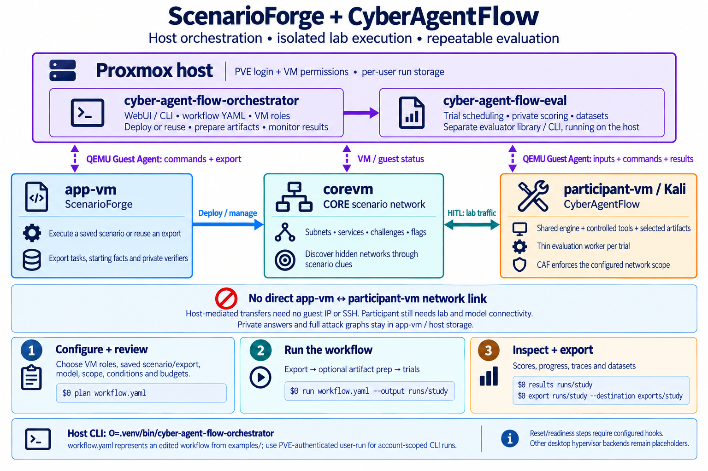
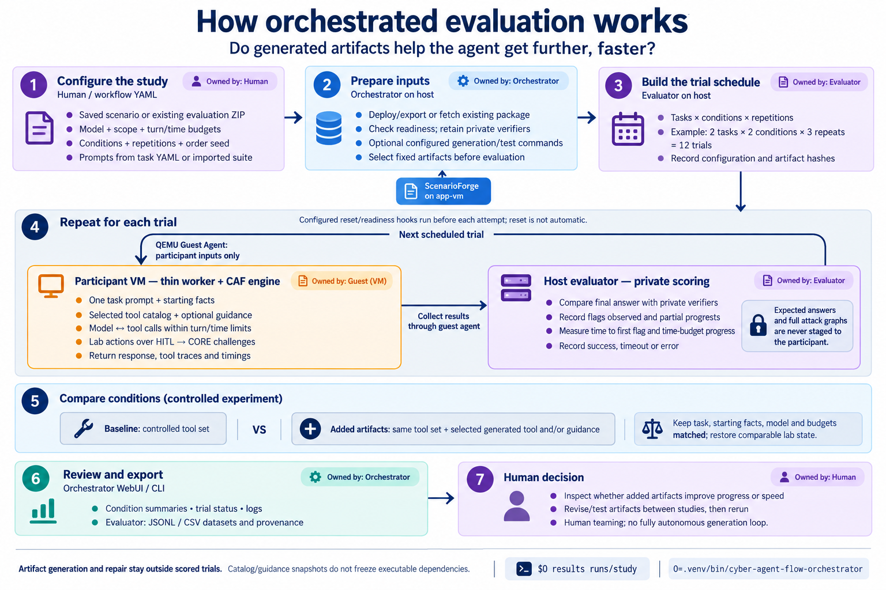

# cyber-agent-flow-eval

A separate evaluation application for repeatable comparisons of generated tools
and guidance. It imports ScenarioForge task packages, runs YAML-defined trials,
scores answers, and writes JSONL/CSV datasets.

The main **cyber-agent-flow** project owns interactive sessions, analysis, artifact
generation, repair and artifact tests. This project owns experimentation. It loads
the shared CAF engine and native MCP tools from a checkout you select; it does not
vendor them, start the WebUI, or import Flask into its coordinator.

For the complete lab lifecycle, use the separate
[`cyber-agent-flow-orchestrator`](../cyber-agent-flow-orchestrator/README.md).
It selects/deploys a saved ScenarioForge scenario (or reuses an export), runs
configured preparation/generation/test commands, freezes condition artifacts,
and calls this evaluator. The evaluator remains usable standalone and owns trial
scheduling, workers, scoring and dataset export. In Proxmox mode both coordinators
run on the host; only the thin worker and CAF engine run inside participant-vm.

The figure below shows the current host orchestration and evaluator architecture. The
[orchestrator architecture and examples](../cyber-agent-flow-orchestrator/README.md)
show the enclosing lab workflow.





Start with the [three simple experiments](examples/README.md): a no-tools smoke
test, controlled tools versus one added helper, and a ScenarioForge challenge suite.

## Install

Use Python 3.10+ on Linux/macOS. Install this project in its own environment:

```bash
cd cyber-agent-flow-eval
python3 -m venv .venv
.venv/bin/python -m pip install -e '.[test]'
```

Install/configure CAF separately, including the Python dependencies and Kali tools
needed by your experiment. The evaluator environment needs only PyYAML and psutil;
workers can use CAF's own Python environment. No model, Docker image, or target is
started during installation or planning.

For host-based trial execution, install this project on the **Proxmox node** and select
`backend.type: proxmox`. The worker runs inside participant-vm through the QEMU
guest agent; no guest IP or SSH connection is needed for transfer/control. See the
[Proxmox setup and run guide](docs/proxmox.md). `local` remains the default;
`macos`, `linux`, and `windows` guest backends are explicit, unimplemented placeholders.

## Select the shared engine

Every evaluation YAML requires an `engine` section:

```yaml
version: 1
id: my-study
engine:
  path: /opt/cyber-agent-flow
  python: /opt/cyber-agent-flow/venv/bin/python
# model, execution, tasks/suite, conditions, repetitions follow
```

`engine.path` selects the checkout containing `mcp_client.py`, `mcp_kali.py`, and
`session_logger.py`. `engine.python` is an optional executable path; if omitted,
workers use the evaluator's Python interpreter, which must then have CAF's
dependencies installed. Paths can be absolute or relative to the YAML file, and
`~` is supported for local execution. With Proxmox, both paths must be absolute
**participant guest paths**, and `engine.python` is required. An interpreter path is a filename, not a shell command or PATH
lookup. Virtual-environment symlinks are preserved.

The selected CAF revision must support tool allowlisting, explicit guidance and
hidden network policy in `MCPSession`. Local planning validates these controls without
importing CAF; remote planning is offline, with guest validation done by
`check-backend` and at run startup. Workers run in fresh processes, load CAF from `engine.path`, use that
directory as their working directory, and start its native MCP server with the
chosen interpreter. Catalog and log paths remain specific to the trial.

## Run simple experiments from Proxmox

Run these commands as root from this checkout on the **Proxmox node hosting the
lab VMs**, after installing the evaluator above. The examples use ScenarioForge's
default VM IDs: corevm **9401**, app-vm **9402**, participant-vm **9403**. QEMU Guest
Agent handles transfers and commands; CAF and its tool dependencies must already
be installed in participant-vm. No app-vm–participant-vm network link is needed.

Before running, edit **each example YAML you use**: set the model provider, URL,
and name, and adjust VM IDs, guest account, and CAF paths if needed.
`localhost:11434` means the model is running inside **participant-vm**, not on the
host. See [Proxmox configuration](docs/proxmox.md#configuration) for guest API-key
environment files and other options.

```bash
E=.venv/bin/cyber-agent-flow-eval
```

| Example | What it measures | Trials | Budget per trial |
| --- | --- | --- | --- |
| [Smoke test](examples/01-smoke.yaml) | Execution and exact-answer scoring, with no tools | 1 | 3 engine turns / 120 seconds |
| [Controlled tools plus a helper](examples/02-tools-vs-added.yaml) | Flag recovery and speed with an added tool | 6 | 12 engine turns / 120 seconds |
| [ScenarioForge runtime template](examples/03-scenarioforge-runtime.yaml) | The same comparison on exported challenges | 4 per imported task | 20 engine turns / 300 seconds |

Each trial is a fresh conversation with one task prompt. Turn limits are not exact
model-call counts: summarization and retries may make additional calls. Transfer
and orchestration time is outside the worker's wall budget.

### 1. Smoke test without tools

```bash
"$E" check-backend --config examples/01-smoke.yaml
"$E" plan examples/01-smoke.yaml
"$E" run examples/01-smoke.yaml --output eval-runs/01-smoke
```

The model receives a supplied observation and should return `{"open_ports":[80]}`.
This checks guest staging, model access, result collection, and scoring without
needing a target service. It does not measure tool quality or discovery.

### 2. Controlled tools versus the same tools plus a helper

Start the included, read-only HTTP fixture on **corevm's HITL address** through
the guest agent. It serves four in-memory pages containing two demo flags and runs
outside the CORE-emulated scenario:

```bash
qm guest exec 9401 --pass-stdin 1 -- /usr/bin/python3 - \
  --bind 10.254.200.3 --port 8080 < examples/http-demo.py
qm guest exec 9401 -- systemctl is-active caf-eval-http-demo.service
qm guest exec 9403 -- curl --fail --silent --show-error --max-time 5 \
  http://10.254.200.3:8080/
```

Confirm the returned guest `exitcode` is zero, the service is `active`, and the last
command returns the demo index. If `qm` returns only a PID, poll with
`qm guest exec-status VMID PID`. If your HITL address or port differs, update the
setup arguments, task URL, and YAML scope together. Use an updated CAF engine with
the numeric-URL IP/CIDR scope fix; do not widen the allowlist to work around an old
engine rejecting an allowed URL.

```bash
"$E" plan examples/02-tools-vs-added.yaml
"$E" run examples/02-tools-vs-added.yaml --output eval-runs/02-tools-vs-added
```

Both conditions receive the same task and budgets. **Baseline** provides `nmap`,
`curl`, and `python3`; **added-helper** preserves those exact definitions and adds
`http_flag_walk`. One task × two conditions × three repetitions produces six trials,
with condition order shuffled within each repetition.

The [helper](examples/artifacts/http_flag_walk.py) is a **hand-authored stand-in**
for a generated artifact. It follows bounded, same-origin HTTP links and reports
flag strings; it contains no expected answers. Its source is embedded in the
catalog, so it needs no separate script transfer. Replace it with your tested
CAF-generated artifacts for an actual study. The demo flags are public examples,
and neither a treatment improvement nor a statistical conclusion is assumed.

The fixture is stateless, so these trials need no reset. It uses a dedicated
service and stops automatically after one hour. To stop it sooner:

```bash
qm guest exec 9401 --pass-stdin 1 -- /usr/bin/python3 - --stop < examples/http-demo.py
```

### 3. Run your ScenarioForge challenges

Generate an evaluation export through ScenarioForge's WebUI or CLI, including
passing readiness for the deployed scenario. Edit
[03-scenarioforge-runtime.yaml](examples/03-scenarioforge-runtime.yaml) for your
actual scope, controlled tools, generated artifacts, model, and budgets. Then fetch
the ZIP from app-vm and import it on the host:

```bash
"$E" fetch-suite --config examples/03-scenarioforge-runtime.yaml \
  --guest-path /absolute/path/in/app-vm/evaluation-export.zip \
  --output eval-inputs/example-suite

"$E" import-suite eval-inputs/example-suite \
  --config examples/03-scenarioforge-runtime.yaml \
  --output eval-inputs/example-study.yaml

"$E" plan eval-inputs/example-study.yaml
"$E" run eval-inputs/example-study.yaml --output eval-runs/03-scenarioforge
```

Replace the ZIP path with the path reported by ScenarioForge. The runtime file is
an **import template**, not a standalone experiment: the export supplies tasks,
prompts, starting facts, and private verifiers. Two conditions × two repetitions
give four trials per imported task; three tasks would produce 12 trials. Select
tools appropriate for the actual challenges—the sample HTTP helper is specialized.

For state-changing challenges, configure tested
[reset/readiness hooks](docs/proxmox.md#resets-and-readiness) before each attempt.
Keep scenario state, starting facts, model, and budgets constant between conditions.
A fresh conversation alone does not restore the network.

### Read the results

Open `dataset.csv` in the selected output directory for the comparison table;
`dataset.jsonl` contains the fuller records. Pair conditions by `pair_id` and inspect:

- `status` and `verified_success`: whether execution completed and its final answer passed.
- `score`: fraction of expected flags in the final answer for flag tasks.
- `flags_observed`, `progress_score`, `time_to_first_flag_seconds`: progress from captured output, including timed-out attempts when telemetry is available.
- `execution_seconds`: worker execution and control overhead, excluding staging and collection; `elapsed_seconds` also includes orchestration.

Each flag attempt's `progress.json` contains timestamped milestones and checkpoint
counts. Proxmox worker traces and model calls are under `guest-output/` within the
attempt directory. Observed flags measure progress, not independent proof of an
exploit; unavailable telemetry produces null progress scores.

Use a new output directory when changing configuration or artifacts. Continue an
unchanged run with `--resume`, adding `--retry-failed` when retries are intended.
Earlier attempts remain in the dataset. See the [full examples guide](examples/README.md)
for a result-inspection command, catalog rebuilding, and recovery details.

## Run locally

The local `configs/experiments/` examples assume sibling checkouts and CAF's environment at `venv/bin/python`.
Edit `engine`, model, scope and artifact paths to match your installation:

```bash
.venv/bin/cyber-agent-flow-eval plan configs/experiments/example.yaml
.venv/bin/cyber-agent-flow-eval run configs/experiments/example.yaml \
  --output eval-runs/example
```

Equivalent module invocation: `.venv/bin/python -m cyber_agent_flow_eval ...`.
The installed CLI works from any directory; YAML paths resolve relative to the
YAML file, while `--output` resolves relative to your current directory.

For local execution, manually transfer the ScenarioForge evaluation ZIP:

```bash
unzip suite.zip -d eval-inputs/suite
.venv/bin/cyber-agent-flow-eval import-suite eval-inputs/suite \
  --config configs/experiments/scenarioforge-suite.example.yaml \
  --output configs/experiments/study.yaml
.venv/bin/cyber-agent-flow-eval plan configs/experiments/study.yaml
.venv/bin/cyber-agent-flow-eval run configs/experiments/study.yaml \
  --output eval-runs/study
```

The supplied nmap-only conditions are for inventory comparisons, not general flag
challenges. Configure suitable tools and model before importing. Import preserves
the configured engine, interpreter, scope, conditions and budgets, rebasing paths
when the output YAML is elsewhere. It does not edit CAF's interactive configuration.

## Records and repeatability

Each task × condition × repetition is a trial with a fresh conversation. Attempts,
checkpoints, model calls, tool records and verifier outputs belong to this project’s
chosen output directory. Manifests record separate evaluator and CAF source hashes,
the configured engine/interpreter, and both runtime identities. Resume refuses changed
configuration, recorded source or dependency identities. External tool binaries,
model weights and live scenario state still require separate versioning/restoration.

Generation/testing remain in the main app. This evaluator consumes selected artifacts;
it does not repair tools or provide automatic hints. Proxmox can run explicitly
configured reset/readiness commands before each trial; it has no built-in CORE reset.
Private verifiers stay on the coordinator and are never staged into the participant
guest. Local execution still shares files with same-user tools. Discovery scope
stays enforced while omitted from model prompts. Timestamped expected-flag
observations report time to first flag and progress at configured checkpoints,
including evidence recovered after timeouts. See [the evaluation contract](docs/experiments.md) and
[the generation-to-evaluation workflow](docs/artifact-evaluation-workflow.md).

## Tests

```bash
.venv/bin/python -m pytest -q
```

Tests default to a sibling `cyber-agent-flow` checkout and its `venv/bin/python`.
Override `CAF_TEST_ENGINE_DIR` and `CAF_TEST_ENGINE_PYTHON` for another installation.
Integration tests use a local mock model and include a relocated CAF checkout with
spaces in its path. Proxmox tests emulate QGA/systemd and exercise binary transfers,
worker staging, collection, cleanup failures, recovery and suite validation. They
do not contact a live Proxmox node, live models or CORE targets.

## Migration from the embedded evaluator

The former CAF `experiments/` package, execution adapter, evaluation configs and tests
have moved here. Replace `python -m experiments` with `cyber-agent-flow-eval` or
`python -m cyber_agent_flow_eval`, add `engine.path` (and normally `engine.python`),
and rebase any relative catalog/guidance paths when moving your YAML. ScenarioForge
package versions 1–3 remain readable. Start a new output directory: old run manifests
cannot resume across this source/configuration change. Old datasets remain inspectable
and can be re-exported with the `export` command.

## Integration with the lab orchestrator

Version 0.2.0 adds `cyber_agent_flow_eval.integration` for the separate host
orchestrator. It exposes runtime-template loading/rebasing, the existing Proxmox
transport, suite import, evaluation execution, recovery, and `TargetReservation`.
A reservation keeps `execution.target_lock` held across deployment/preparation
and `run(..., reservation=reservation)` without acquiring the same lock twice.
All workflows and standalone evaluations of the same lab must use the same lock
path. Existing CLI commands and standalone YAML files still work.

Imported workflow studies may contain optional host-only provenance:

```yaml
orchestration:
  workflow_id: generated-artifact-study
  workflow_hash: aaaaaaaaaaaaaaaaaaaaaaaaaaaaaaaaaaaaaaaaaaaaaaaaaaaaaaaaaaaaaaaa
```

The orchestrator fills these values. They are retained in the frozen manifest
and dataset JSONL rows, never added to participant prompts or worker inputs.
Proxmox `before_trial` hooks now also accept optional `user`, `cwd`, and
`environment_file` guest settings. They still execute before every attempt;
workflow-level preparation runs once before the study. The evaluator does not
create/deploy scenarios or generate artifacts by itself.

## Inspect and export experiments from the CLI

The evaluator already has its own CLI; it does not require the orchestrator:

```bash
.venv/bin/cyber-agent-flow-eval --help
.venv/bin/python -m cyber_agent_flow_eval --help
.venv/bin/cyber-agent-flow-eval list --root eval-runs
.venv/bin/cyber-agent-flow-eval status eval-runs/my-study
.venv/bin/cyber-agent-flow-eval results eval-runs/my-study
.venv/bin/cyber-agent-flow-eval logs eval-runs/my-study --trial trial-000001 --lines 50
.venv/bin/cyber-agent-flow-eval export eval-runs/my-study --destination exports/my-study
```

`list`, `status`, `results` and `logs` return JSON without contacting guests or a
model. They read authoritative attempt records, including partial/failed attempts,
instead of trusting a cached dataset. Status reports planned/unstarted trials,
attempt counts, condition summaries, and whether the coordinator lock is held.
A lock check describes the host coordinator, not live guest health.

`results` defaults to the latest attempt per trial. Add `--all-attempts` to results
or destination export to include retries in the rows. Summaries always count only
latest attempts: `success_rate` uses completed trials with boolean verification
results as its denominator, mean final score uses completed trials, and progress/
execution-time means use available values including timeout/error trials. Inspect
status counts alongside scores; missing metrics remain `null`.

`logs` accepts `--attempt N` (default: latest) and `--lines N` (default: 100).
It returns collected worker logs and preparation-hook logs, not a live stream.

The original `export RUN` still rebuilds the full JSONL/CSV dataset inside the run.
With `--destination NEW_DIR`, export instead writes `summary.json`, `dataset.jsonl`
and `dataset.csv` outside the original run without changing its dataset. Destination
export defaults to latest attempts. Exports refuse active coordinator locks and
existing destinations. Rows may include discovered flags and final answers; these
are private analysis exports, not redacted participant bundles.

Version 0.3.0 adds `cyber_agent_flow_eval.reporting` as a reusable service layer for
these commands and the orchestrator's WebUI. Planning/execution CLI commands,
backend checks, suite import/fetch, recovery, and standalone local/Proxmox execution
remain available. `runner.run(..., progress=callback)` now permits application
clients to route progress without parsing terminal output; use `progress=None`
for quiet execution.

The orchestrator now has a [read-only lab dashboard](../cyber-agent-flow-orchestrator/docs/webui.md).
New Proxmox worker and hook journals include command arguments and start timestamps
for live monitoring. Application presence and process status are observations, not
substitutes for evaluation readiness checks.

Version 0.4.0 adds an optional Proxmox dispatch-authorization context for host
applications. `authorized_operations(check)` captures a caller-provided guard in
each `GuestAgent`; the guard runs before every `qm` subprocess, including transfer
chunks and exec-status polling. The orchestrator uses it to recheck PVE user/VM
access. Standalone evaluator calls remain trusted host/local CLI operations unless
the caller explicitly supplies this context. No PVE ticket is staged into a guest.

Version 0.4.2 optimizes Proxmox uploads: 512 KiB chunks go through
`qm guest exec --pass-stdin`, with a short synchronous wait for each write. If
the write is still running, the existing PID is polled without retransmitting
the chunk. The base64 JSON request stays below the documented 1 MiB stdin limit
and payloads are not passed as command-line arguments. The final guest file size
and SHA-256 must match before the transfer succeeds. Downloads remain at 16 KiB
to respect QGA's captured-output limit. Authorization callbacks still run before
every host `qm` invocation, including each write and any fallback status poll.

For a 3,213,005-byte bundle, seven writes plus the final checksum require nine
host invocations when writes finish synchronously, compared with at least 396
previously. Local integration tests run the actual Python guest helper with
simulated `qm` transport; live Proxmox timing is not yet measured. Update the host
evaluator checkout and restart its caller to use this path. There is no additional
guest install, network connection or persistent daemon.

See [Proxmox's `qm guest exec` documentation](https://github.com/proxmox/pve-docs/blob/master/generated/qm.1-synopsis.adoc)
for stdin and synchronous-execution limits.

Sample runs expose host-side preparation and guest-stage progress in the
orchestrator WebUI when both host checkouts are updated. Each trial's
`transport.json` records its phase, timestamps, acknowledged input file/byte
counts, and last observed service status. Phases distinguish preparing, uploading,
starting, executing, stopping, collecting and collected. Phase changes are retained
as a bounded event list. These are host journal writes using existing guest calls;
viewing progress adds no guest polling. An upload count advances only after the
file transfer returns successfully. Model turns/tokens are not streamed by this
transport. Optional progress-write failures cannot bypass worker cleanup; the
initial recovery journal remains mandatory before any guest mutation.

Optional `execution.provide_progressive_hints: true` enables host-controlled assistance for ScenarioForge suites. The default is false. Task metadata supplies private `progressive_hints` (ordered strings, e.g. reviewed facilitator excerpts) and/or `discoverable_facts`. No complete guide or unreleased plan is uploaded to the participant. After two turns without new observed fact evidence (or new successful output for tasks without declared facts), or an incorrect final answer, up to three ordinary hints are released within existing budgets. `execution.max_tries_before_solution` (default 6, range 1–1,000) controls how many agent turns without new progress precede the **current challenge's facilitator walkthrough and exact answer/flag**. New progress resets this count; hint releases do not. Full solutions are kept separately in private `challenge_solutions` metadata and released at most once per challenge. Observed flags advance to the next unsolved challenge and reset its try count. Older packages with authored hints fall back to the reviewed task procedure/hints and verifier answer. Incorrect final answers before the limit can receive neutral retry feedback, audited as `retry_feedback` / `retries_requested`. Ordinary hints still exclude literal verifier answers; the gated solution deliberately includes them. Results separate `unassisted_success`, `hints_assisted_success` and `solution_assisted_success`, and record `solution_provided` / `solutions_released`. A success following answer disclosure is never classified as unassisted or hints-only success. Updated CAF `chat(progress_callback=...)` support is required when assistance is enabled and usable guidance is available. Results/CSV distinguish `hints_released`, `facts_revealed`, `assisted_success`, and `unassisted_success`; `assistance.json` preserves the policy and timestamped release audit. Releases are counted conservatively even if transport fails before delivery. If a task has no usable hint source, it runs unassisted and explicitly records `progressive_hints_available: false` with a reason; this does not fail the trial. Authored ordinary hints containing verifier answers still fail validation.

### Judge agent

An optional host-side `judge` configuration enables an LLM agent that reviews
saved trial evidence through bounded read-only tools. It does not run commands
or perform live VM checks. The final pass requires **both** its verdict and the
deterministic output verifier. Judge errors are recorded as `judge_error` with
`verified_success: null`; no silent success fallback occurs.

```yaml
judge:
  enabled: true
  model:
    provider: openai  # openai, litellm, or ollama_direct
    url: http://judge-server:11434/v1
    name: judge-model
    ssl_verify: true
    # Optional: set this in the coordinator/orchestrator's environment.
    api_key_env: JUDGE_API_KEY
  max_turns: 6          # evidence reads plus verdict, 2–32
  timeout_seconds: 120 # total judge budget, independent of worker wall_seconds
  max_tokens: 2048     # output tokens per model request
```

Alternatively, `judge: {enabled: true, use_participant_model: true}` freezes the
participant's model settings for judging; the endpoint must be reachable from
the **host**, and guest credentials are not transferred. API keys stay out of
run files. Specs without `judge` keep their previous deterministic behavior.

The agent reads only inventoried saved results, conversations, events, model-call
records, assistance audits and CAF's native `runs/<run_id>/transcript.md`,
`tool_calls/*.json` and saved text artifacts. When nonempty execution logs are
available, every verdict must cite a log it actually read: native tool records
take priority, followed by events, conversations, model calls and worker logs.
The judge checks tool arguments, outputs, exit codes and errors; invoking a tool
alone does not prove success. Bounded paged reads let it inspect full artifacts
when tool records contain truncated output. Empty reads cannot satisfy the
evidence requirement. Missing execution logs produce an explicit evidence
warning in Results; a final-answer review is not live-state verification.
`judge.json` records its messages, evidence reads, model requests, token usage,
reason and final verdict/error. Results and CSV expose `judge_passed`,
`deterministic_passed`, `judge_score`, `judge_seconds`, `judge_calls`,
`judge_prompt_tokens` and `judge_output_tokens`; missing provider usage stays
unknown. Judging never changes the unassisted/hint-assisted/solution-assisted
classification of the participant trial.
`judge_execution_trace_reviewed`, `judge_evidence_files` and
`judge_evidence_warning` distinguish a log review from a review with limited
evidence. Execution logs remain untrusted input and cannot grant the judge new
tools or change its instructions.
