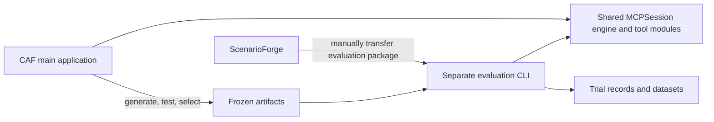

# From generated artifacts to repeatable evaluation

This workflow asks whether a frozen generated tool or guidance document improves
agent task performance. It connects development sessions, artifact generation and
tests, ScenarioForge exports, and CAF's YAML evaluator. Generation and evaluation
are separate stages; the evaluator does not generate or repair artifacts mid-trial.

## Main application versus evaluator

The **CAF main application** provides interactive WebUI/CLI sessions, analysis,
recommendations, artifact generation, follow-up editing, and artifact tests/validation.
The **evaluation application** is a separate headless CLI, invoked with
`cyber-agent-flow-eval`. It consumes frozen artifacts and task packages, runs trials,
scores answers, and exports datasets. It does not launch or automate the main WebUI.

They live in separate projects. The evaluator uses `engine.path` to load the same
`MCPSession` engine and native MCP tools from CAF, and `engine.python` to select its
Python environment. Its execution adapter, configuration and logs live here. Separate
projects/processes do not create a security boundary around same-user files.



The evaluator is a separate project on participant-vm; it selects the CAF checkout
through configuration. The diagram below shows the software boundary.

## Where each component runs

| Component | Responsibility |
| --- | --- |
| ScenarioForge on app-vm | Author and deploy scenarios; generate clues, guides and attack graphs; export tasks, private answers and readiness evidence |
| CORE on corevm | Run the scenario hosts, services, flags, routes and pivots |
| CAF main application on participant-vm / Kali | Interactive teaming, analysis, artifact generation, repair and tests |
| Separate evaluation CLI on participant-vm / Kali | Read evaluation YAML and frozen artifacts; run the shared engine; score and export attempts |

ScenarioForge manages CORE over its management connection. CAF reaches scenario
targets through HITL. In this lab, app-vm and participant-vm have no direct network
connection: manually transfer the evaluation ZIP through your approved mechanism.
CAF does not contact ScenarioForge during evaluation. Configure a separately
reachable inference endpoint for each application that needs one.

## 1. Generate on development work

Run development tasks with a human analyst and retain their session traces. In
**Recommendations**, select a completed analysis and **Create artifact from this
analysis**, or review a recommended asset. Choose its type, name, instructions,
inference endpoint and model. Claude Code creates the files in staging; the
controller validates and publishes them with generation provenance.

| Artifact | Current output and use |
| --- | --- |
| MCP tool | Manifest, executable source, test plan and fixtures; callable after explicit configuration |
| Markdown playbook/document | Operational guidance or reference text; can be included as evaluation guidance |
| Agent skill | Instruction-only SKILL.md plus optional text references/assets; export for installation, or explicitly select its text for an evaluation |
| RAG document | Document, metadata and derived chunks; export for ingestion, with no built-in retrieval service |
| Reusable template / structured JSON | Validated files for explicit downstream use; not automatically activated in trials |

See [generation setup and repair](../../cyber-agent-flow/docs/claude-generation.md) and
[artifact formats, storage and provenance](../../cyber-agent-flow/docs/generated-artifacts.md). A generated
artifact does not automatically become enabled or part of an experiment.

## 2. Test, repair and validate

Three different checks answer different questions:

| Check | What it establishes |
| --- | --- |
| Artifact validation | Required files, syntax, metadata and format are acceptable |
| Generated-tool container tests | The tool meets its supplied cases in the recorded fixture environment |
| Scenario evaluation | An agent with a particular artifact condition completes the task under the configured budget |

Prepare the reusable test image on the CAF machine while Docker is available:

```bash
venv/bin/python gen-tool_tests.py build
venv/bin/python gen-tool_tests.py run TOOL_FOLDER
venv/bin/python gen-tool_tests.py show TOOL_FOLDER
```

Replace TOOL_FOLDER with the directory under `plugins/mcp_tools/`. Initial tool
generation runs tests automatically and allows up to two implementation repairs
after the first attempt. The first valid test suite and fixtures stay frozen.
Missing Docker/image produces an unavailable result; it does not trigger an
installation. Published, format-valid source can still have failed or unavailable
tests. Inspect the separate test status before selecting a candidate.

For follow-up work, use **Continue with Claude → Send prompt → Test**. Follow-up
edits do not automatically rerun tests. Document formats use **Validate** instead.
File changes make prior reports outdated. Keep the report for the exact selected
artifact hash and the test image ID, and review generated assertions independently.

The default file/HTTP fixtures run without external networking. They do not prove
that a tool works against CORE or that it improves an agent. See
[tool testing and cleanup](../../cyber-agent-flow/docs/generated-tool-testing.md) for the suite format,
resource limits, Docker cleanup and opt-in runtime checks.

## 3. Freeze and configure artifact conditions

Archive the selected source, manifest, tests/fixtures, provenance, generation jobs,
repair history, validation/test reports and dependency/image identities. Keep
development material separate from held-out tasks. If an evaluation result leads
to an edit, it is a new artifact version and a new experiment configuration/output.

CAF freezes catalog JSON, selected tool names and guidance text. It does **not**
copy or freeze referenced executables, containers or their dependencies. Put selected
executables in a stable location and archive them separately. Record the generation
job and test-report IDs alongside the study; evaluation rows do not automatically
join every generation/repair cost into their lineage.

Use a dedicated native MCP catalog with valid executable paths. A generated tool's
manifest is one tool entry, not an entire catalog. For example, adapt this entry to
your installed, tested tool and interpreter:

```json
{
  "tools": [
    {
      "name": "http_probe",
      "command": "/opt/caf/venv/bin/python",
      "base_args": ["/opt/caf/frozen/http_probe/probe.py"],
      "description": "Inspect an HTTP endpoint discovered from scenario evidence.",
      "allow_args": true
    }
  ]
}
```

Include the baseline tools in a treatment catalog when comparing baseline versus
baseline plus a generated tool. Avoid task answers and hidden addresses in tool
descriptions. Do not depend on relative executable paths or the WebUI's enabled
selection: the evaluation catalog and `conditions[].tools` define availability.

An optional four-condition design is:

| Condition | Tool catalog/selection | Guidance |
| --- | --- | --- |
| Baseline | Baseline tools | None |
| Guidance | Same baseline tools | Selected frozen document(s) |
| Tool | Baseline plus generated tool | None |
| Combined | Baseline plus generated tool | Same selected document(s) |

List document paths explicitly in `guidance_files`. This injects text; it does not
install a skill runtime, recursively load a skill's references, fill template
variables, or activate RAG retrieval. Include or prepare the exact text your study
intends to compare. Catalog/guidance paths are relative to the evaluation YAML.

## 4. Prepare and export the scenario

Keep the saved resolved scenario fixed. On app-vm, with CORE configuration already
set, use the ScenarioForge environment:

```bash
python -m scenarioforge.cli execute \
  --xml scenario.xml --scenario Training \
  --evaluation-export \
  --evaluation-tasks discovery-tasks.json \
  --evaluation-output-dir /tmp/suite
```

Replace paths and the scenario name. The requested workflow creates the package
and `/tmp/suite.zip`, collects fresh readiness evidence, and fails if the requested
export/readiness workflow fails. For an already deployed scenario, use the separate
`check-artifacts` and `evaluation-export` workflow in [experiments.md](experiments.md).
Successful WebUI executions also prepare a package under **Reports → Download**.

For hidden discovery, authored tasks declare explicit starting facts (entry subnet,
initial credentials), private discoverable facts (internal subnet), their evidence
locations and dependencies. Place the actual clue in the scenario; metadata alone
does not create it or establish routing. ScenarioForge's network-discovery-clue
generator template can emit a subnet-bearing file for injection.

Use the same task file for ScenarioForge's `guides` and `attack-graph` CLI exports,
or save the definitions in `FlowState.evaluation_tasks` for WebUI/automatic exports.
Starting facts appear in guides and graph exports. Discovery participant guides
contain a starting briefing; full graphs, facilitator guides and evaluator answers
remain private. Ordinary default flag tasks disclose objective IPs and are not
hidden-discovery tasks. See ScenarioForge's `docs/EVALUATION_EXPORT.md` and
`docs/examples/evaluation-discovery-tasks.json` for its authoring contract.

## 5. Transfer, import and run on Kali

Manually transfer the ZIP to participant-vm. CAF owns the execution scope: put all
permitted subnets and exclusions in the runtime YAML's `execution.network_policy`.
Import preserves it; ScenarioForge has no evaluation allow/disallow flags. Known
objective conflicts block import/plan/run without widening permissions.

```bash
unzip suite.zip -d eval-inputs/suite

.venv/bin/cyber-agent-flow-eval import-suite eval-inputs/suite \
  --config configs/experiments/runtime.yaml \
  --output configs/experiments/study.yaml

.venv/bin/cyber-agent-flow-eval plan configs/experiments/study.yaml
.venv/bin/cyber-agent-flow-eval run configs/experiments/study.yaml \
  --output eval-runs/study
```

Create `runtime.yaml` first using the [suite example](../configs/experiments/scenarioforge-suite.example.yaml),
with your engine path/interpreter, model, catalogs, scope, budgets and repetitions. The example's nmap-only
selection suits inventory tasks; it is not sufficient for general flag challenges.
Import reads the referenced catalogs and guidance files. Install and verify all
selected executable dependencies before running; import does not verify their
entire runtime environment.

Each trial receives one initial task prompt. Main engine iterations are limited by
`max_turns`, with a wall deadline and tool timeout; summaries/retries can produce
additional model calls. Trials = tasks × conditions × repetitions. A one-task,
four-condition study with three repetitions creates twelve trials, not twelve
independent scenarios. Every attempt starts a fresh conversation.

The model sees the starting briefing and selected tool descriptions/guidance.
Evaluation policy lists are hidden from prompts by default, while enforcement still
uses them. Discovery suites reject policy disclosure and direct hidden-fact leaks in
the configured text/catalogs. No automatic hints or simulated human teammates are
added. A required human decision ends the unattended attempt as `interaction_required`.

## 6. Inspect results and respect current limits

Inspect `dataset.csv`, `dataset.jsonl`, and each attempt's checkpoint, model calls,
tool records, result and verifier checks. Ordinary flags use `flags_match`; discovery
uses `flags_found` so the agent can return recovered strings without knowing private
objective IDs. Both support partial scoring. A completed execution is not necessarily
a successful task, and a passing tool test is not an efficacy result.

Readiness is timestamped historical evidence, not a live probe before each trial.
The runner does not reset CORE, automate the development/generation cycle, isolate
evaluator files from same-user tools, aggregate paired statistical results, or fully
account for work inside generated tools. Reserve the lab, validate restoration for
state-changing tasks, and use separate storage/permissions or sandboxing when strict
answer secrecy is required. Treat raw traces as private before dataset publication.

For the complete YAML and dataset contract, see [experiments.md](experiments.md).
For research claims, partitions and planned analyses, see the
[research plan](../../cyber-agent-flow/experiment-ideas/generated-artifact-evaluation-research-plan.md).

## Developer verification

From cyber-agent-flow-eval, run `.venv/bin/python -m pytest -q`. Integration tests
use a configured CAF checkout, its interpreter, and a local mock model; they also
verify engine selection, package import, source-change rejection and path rebasing.
Override CAF_TEST_ENGINE_DIR and CAF_TEST_ENGINE_PYTHON for another test installation.

Artifact generation, container-test and UI regression tests stay in the main CAF
repository. Run them there following its [artifact test documentation](../../cyber-agent-flow/docs/generated-tool-testing.md)
and [generation documentation](../../cyber-agent-flow/docs/claude-generation.md).
No repository test establishes artifact efficacy against a live CORE scenario.
