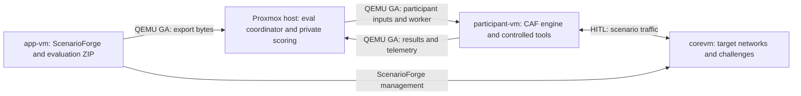

# Run evaluations from a Proxmox host

The evaluator coordinator runs on the Proxmox node hosting the lab VMs. It uses
`qm guest exec` and `qm guest exec-status` to execute short Python helpers through
QEMU Guest Agent. Files travel as bounded, checksummed binary chunks over that
same channel. Neither SSH nor guest IP addresses are used for orchestration.

See the [updated architecture PNG](../scenarioforge_cyber-agent-flow.png) and
[three runnable examples](../examples/README.md), including a small HTTP fixture
you can start through the guest agent before trying a full ScenarioForge scenario.



There is no app-vm–participant-vm link. The host deliberately transfers participant
inputs between these otherwise separated VMs. Private task verifiers, attack graphs,
and hidden fact metadata stay on the host. The full scope policy still reaches CAF
for enforcement and is hidden from model prompts; it is not secret from guest tools
with filesystem access. Model access and scenario traffic still require the network
connections already used by CAF; “no IP required” applies to orchestration only.

For scenario deployment and artifact preparation around these trials, use the
separate [lab orchestrator](../../cyber-agent-flow-orchestrator/README.md).
This document describes the evaluator backend it calls. The backend remains
available independently, and no full evaluator installation is required in a guest.

## Prerequisites

- Run as root on the **Proxmox node that owns both VMs**, with `qm` available. This
  backend does not manage multiple cluster nodes or forward commands over SSH.
- Running Linux guests with Python 3 and QEMU Guest Agent enabled both inside the
  guest and in the VM configuration. Participant-vm (and any hook VM) also needs
  systemd 250+ for `ExitType=cgroup`, supported by the provisioned Debian 12 and
  Ubuntu 24.04 guests.
- Install/configure CAF and required tool binaries in participant-vm. A compatible
  CAF checkout must expose `allowed_tools`, `guidance_text` and
  `reveal_network_policy` on `MCPSession`. The evaluator stages its small worker
  package automatically; a separate evaluator installation in the guest is not required.
- Use the participant account that owns CAF. Tool permissions remain those of that
  account. Tools requiring elevated privileges need your existing explicit setup.

ScenarioForge's Proxmox provisioning script installs/enables `qemu-guest-agent`,
sets `--agent enabled=1`, and defaults to corevm **9401**, app-vm **9402**,
participant-vm **9403**. With its optional CAF installation, the checkout is
`/opt/cyber-agent-flow`, its interpreter is `venv/bin/python`, and its owner is
`participant`. Check your chosen provisioning overrides.

Proxmox's [official qm command reference](https://pve.proxmox.com/pve-docs/qm.1.html#cli_qm_guest_exec)
documents asynchronous execution and status polling. The backend rejects truncated
responses and does not interpolate commands into shell strings.

## Configuration

Start with [proxmox.example.yaml](../configs/experiments/proxmox.example.yaml).
It is a runnable **supplied-evidence smoke test**, not a challenge-tool catalog.
Before running a study, set the model, scope, budgets, and both artifact conditions:

```yaml
backend:
  type: proxmox
  participant_vmid: 9403
  app_vmid: 9402
  user: participant
  workspace: /var/lib/cyber-agent-flow-eval
  guest_python: /usr/bin/python3
  # Optional existing systemd EnvironmentFile INSIDE participant-vm:
  # environment_file: /etc/cyber-agent-flow-eval.env
engine:
  path: /opt/cyber-agent-flow
  python: /opt/cyber-agent-flow/venv/bin/python
execution:
  wall_seconds: 900
  max_turns: 30
  progress_seconds: [60, 300, 600, 900]
  network_policy:
    allow: [10.77.0.0/24, 10.78.0.0/24]
    disallow: [10.78.0.254/32]
  target_lock: ../../eval-runs/locks/my-lab.lock
conditions:
  - id: baseline
    catalog: artifacts/controlled-tools.json
    tools: [nmap, curl, your_other_controlled_tools]
  - id: generated
    catalog: artifacts/controlled-plus-generated-tools.json
    tools: [nmap, curl, your_other_controlled_tools, your_generated_tool]
```

The second catalog should preserve every baseline definition and add the generated
tools. Hold guidance constant if tool additions are the treatment being measured.
These catalog paths and tool names are study-specific placeholders, not supplied
artifacts. Catalogs and guidance are read on the **host**; executable paths and
relative commands inside catalogs resolve in the **guest CAF checkout**. Executable
scripts, images, and binary dependencies must already exist in that guest.

| Setting | Meaning |
| --- | --- |
| `backend.type` | `proxmox`, or `local` for existing same-machine execution |
| `participant_vmid`, `user` | Required worker VM ID and Linux account |
| `app_vmid` | Required for `fetch-suite` |
| `workspace` | Dedicated guest staging directory; default `/var/lib/cyber-agent-flow-eval` |
| `guest_python` | Guest stdlib helper interpreter; default `/usr/bin/python3` |
| `environment_file` | Optional absolute participant guest path to a systemd environment file |
| `command_timeout` | Each management operation deadline; default 30 seconds |
| `poll_seconds` | Status polling interval; default 1 second |
| `max_transfer_bytes` | Per-file/archive and expanded-output limit; default 256 MiB |
| `before_trial` | Optional guest reset/readiness commands, described below |

`engine.path` and `engine.python` are required absolute guest paths for Proxmox.
No CAF checkout is required on the host. Host YAML-relative paths still apply to
catalogs, guidance, suite paths, and the target lock.

The worker is a systemd service, so it does not source an interactive shell profile.
`model.url` is interpreted from participant-vm. If `model.api_key_env` is set, put
that variable in the configured guest environment file; host shell variables are
not automatically forwarded. The file may also set PATH for tools installed outside
system directories. Do not put actual keys in YAML or catalogs.

## Commands on the Proxmox host

Install in a virtual environment, then check the participant runtime:

```bash
git clone https://github.com/raistlinJ/cyber-agent-flow-eval.git
cd cyber-agent-flow-eval
python3 -m venv .venv
.venv/bin/python -m pip install -e .
.venv/bin/cyber-agent-flow-eval check-backend \
  --config configs/experiments/proxmox.example.yaml
.venv/bin/cyber-agent-flow-eval plan configs/experiments/proxmox.example.yaml
.venv/bin/cyber-agent-flow-eval run configs/experiments/proxmox.example.yaml \
  --output eval-runs/proxmox-smoke
```

After ScenarioForge generates an evaluation ZIP, fetch it directly from its absolute
path in app-vm. Replace the sample path with the path reported by ScenarioForge:

```bash
.venv/bin/cyber-agent-flow-eval fetch-suite \
  --config configs/experiments/proxmox.example.yaml \
  --guest-path /path/to/scenarioforge/evaluation-export.zip \
  --output eval-inputs/my-suite
```

`fetch-suite` validates archive paths, file hashes, and the package contract before
publishing the host directory. It does not start ScenarioForge or generate a fresh
export. Configure your controlled/generated conditions in a copy of the example,
then import and run:

```bash
.venv/bin/cyber-agent-flow-eval import-suite eval-inputs/my-suite \
  --config configs/experiments/my-proxmox-runtime.yaml \
  --output configs/experiments/my-study.yaml
.venv/bin/cyber-agent-flow-eval plan configs/experiments/my-study.yaml
.venv/bin/cyber-agent-flow-eval run configs/experiments/my-study.yaml \
  --output eval-runs/my-study
```

Planning is offline: it validates guest path syntax without reading host paths as
guest files. `check-backend` and run startup inspect the actual selected guest CAF
source, evaluation controls, account, Python runtime and package versions.

### CAF engine lacks evaluation controls

This means the probe read the CAF source at `engine.path` **inside the selected
participant VM**, but its `MCPSession` constructor lacks one or more of
`allowed_tools`, `guidance_text`, and `reveal_network_policy`. No evaluation trial
has started. The controls are included in CAF commit `8d262fd` and current `main`.

Check that the selected participant VM and guest paths are correct. In that VM,
open the configured CAF checkout (the provisioning default is
`/opt/cyber-agent-flow`) as its owning account, and run:

```bash
git status --short
git branch --show-current
git log -1 --oneline
git pull --ff-only
```

Keep any local changes; do not reset the checkout to make an update succeed. If
it tracks a custom branch or pinned revision, bring in the evaluation controls
there or point `engine.path` and `engine.python` to a compatible checkout and its
Python environment. Restart the orchestrator after changing its runtime config,
then start a fresh sample. The error now reports the guest path and exact missing
controls to distinguish an old checkout from a wrong path.

Updating the host orchestrator or host evaluator, installing an evaluator copy
inside the VM, or running host `uv sync` cannot add these controls to the guest
CAF source. The compatibility check is required for controlled tool selection,
guidance and hidden network-policy handling; do not bypass it.

## Resets and readiness

No reset command is inferred or run by default. Configure explicit **guest argv
arrays** if your lab has a tested reset/readiness script:

```yaml
backend:
  type: proxmox
  participant_vmid: 9403
  app_vmid: 9402
  user: participant
  before_trial:
    - vmid: 9401
      argv: [/opt/my-lab/reset-and-check, --scenario, my-scenario]
      timeout_seconds: 180
```

This is an example custom script, not an existing ScenarioForge command. Hooks run
as guest root, sequentially before **every attempt**, including retries. They have
their own systemd timeouts and logs; a failed hook stops the experiment before the
worker starts. A hook must restore the intended state and fail if its readiness
check fails. Hooks that alter deployment identity/session IDs require a fresh export
and study configuration; the frozen suite's historical readiness is still enforced.
Hook source, VM snapshots, binaries and model weights need separate versioning.

## Results, timing and recovery

Host `attempt.json`, `evaluation.json`, and `progress.json` stay in the normal trial
directory. Collected worker files are under **`guest-output/`**, including model
calls, events, CAF transcripts, and any final result. `transport.json` records the
guest workspace and systemd unit; hook records/logs sit alongside it.

Each trial gets a fresh UUID workspace and service. `RuntimeMaxSec` enforces the
wall budget inside the guest even if the coordinator dies. `KillMode=control-group`
stops the worker and its ordinary descendant processes. `ExitType=cgroup` keeps
the deadline active if the main worker exits while tool descendants remain.
Ctrl-C also requests a stop.
An unconfirmed stop aborts further trials as `cleanup_failed`; restore guest-agent
access and resume the same output directory. Resume stops unfinished recorded
services and retrieves their outputs before starting another attempt. Result
collection can be retried if transfer failed after the worker stopped.

If readiness has expired or source/configuration changes prevent normal resume,
stop and collect the old attempts without restarting trials:

```bash
.venv/bin/cyber-agent-flow-eval recover \
  --config configs/experiments/my-study.yaml --output eval-runs/my-study
```

`recover` validates the participant VM selection but does not require a current
suite/readiness report or matching source hashes. It updates transport journals
and collects files; normal resume reconciles attempt status and progress scores.

The target lock coordinates this host's cooperating runners; an additional VM lock
prevents this host from assigning concurrent experiments to one participant. These
locks do not coordinate other hosts, CAF's WebUI, or manual users. Recovery journals
belong to an output directory: after a coordinator crash, resume that directory
before using the participant for a new study. Guest workspaces and logs are retained
for inspection and must be removed explicitly when no longer needed.

`elapsed_seconds` covers hooks, staging, execution, and collection. The separate
`execution_seconds` excludes hooks and file transfer, but includes launch/status/stop
overhead. Progress timestamps are measured inside the worker from adapter startup,
independent of transfer time and host/guest clock skew.

For flag tasks, `progress.json` records the first observation of each exact expected
flag string in tool output, model responses, or a final answer, plus checkpoint
counts from `execution.progress_seconds`. Its summary fields also appear in JSONL
and CSV: `flags_observed`, `progress_score`, `time_to_first_flag_seconds`. Expected
flag values are not written into this progress report. A partial last event after
a hard kill is ignored and counted as unreadable. Captured evidence remains useful
when the trial times out without a final answer; `verified_success` still remains
null for execution failures. Final-answer correctness and observed progress are
separate measurements. A flag occurrence is not independent proof of an exploit,
route taken, or clue read. Missing/uncollected telemetry is not proof of no progress.
Without usable timestamped telemetry, progress counts/scores are null and
`telemetry_available` is false, rather than recording a zero score.

## Other host platforms and validation

`macos`, `linux`, and `windows` are reserved guest-backend names. They currently fail
with an explicit “placeholder” message; there is no SSH or local fallback. Future
implementations can provide the same identity, staging, launch, cleanup, collection,
and suite-fetch operations using the selected hypervisor's guest facilities.
`local` continues to work on supported Linux/macOS hosts without VM orchestration.

Automated tests emulate QGA/systemd and exercise the real staging/worker/collection
flow, chunk integrity, scope/private-data separation, progress after timeouts,
failed cleanup, resume, malformed archives, and hooks. A live Proxmox deployment is
not available in the development environment; run the smoke test above before a
lab study, and validate a forced timeout and your reset hook on that deployment.

### Guest account for preparation hooks

Each `backend.before_trial` entry additionally accepts `user`, `cwd`, and
`environment_file` (absolute guest paths for the latter two). Without `user`, the
hook retains its existing root execution context. These settings apply only to
that command, not to the evaluator worker. The separate orchestrator uses the
same command transport for its once-per-workflow preparation steps.

## Coordinating with application updates

Evaluator 0.4.1+ takes a shared guest maintenance lock while launching a trial or
hook. The orchestrator takes its exclusive counterpart while updating application
source, checks for existing jobs, and retains a pending recovery marker when an
activation is interrupted. The lock is `/run/caf-application-maintenance.lock`;
the persistent marker is `/var/lib/caf-application-maintenance.pending`. A pending
marker blocks new trial/hook launches after a reboot too. Stop/recovery operations
remain available. Use the orchestrator's application rollback/recovery flow to
resolve interrupted maintenance, rather than deleting the marker to bypass it.

All coordinators sharing these guests need the updated evaluator. Host startup
can inspect `guest_agent.SUPPORTED_OPERATIONS` before dispatching work. Preflight
recovers recorded trial, reset-hook (`caf-eval-hook-*`) and orchestrator units;
unrecorded active CAF units continue to block launch. Helpers are transferred
from the host, so these fixes need a host evaluator update, not guest reprovisioning.

The Proxmox engine probe also records `engine_revision` and `engine_modified` in the manifest's
`engine_runtime` when CAF is a Git checkout, alongside the existing source hash.
